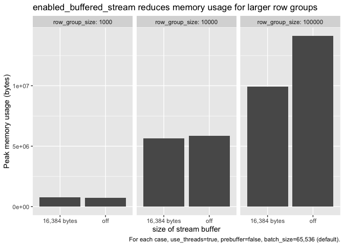

Parquet Read Memory Usage
================

The benchmarks in this repo are designed to determine to what degree we
currently can tune the Arrow C++ Parquet reader to use less memory.

## Analysis

``` r
library(arrow)
library(ggplot2)
library(dplyr)

data <- read_json_arrow("data.jsonl")
```

``` r
data %>%
  filter(use_buffered_stream == 1 & use_threads == 1 & prebuffer == 1) %>%
  ggplot(aes(x = as.factor(row_group_size), y = max_memory)) + 
    geom_col() +
    facet_grid(~ batch_size, labeller = as_labeller(function(x) paste0("batch_size=", x))) + 
    labs(
      title="Peak memory usage determined by row group size",
      subtitle="Batch size has minimal effect",
      x = "Number of rows per group",
      y = "Peak memory usage (bytes)",
    )
```


``` r
data %>%
  filter(use_threads == 1 & prebuffer == 1 & batch_size == 65536) %>%
  # Don't show extraneous data points
  filter(use_buffered_stream == 0 | buffer_size == 16384) %>%
  mutate(buffered_stream = as.factor(ifelse(use_buffered_stream == 1, 
    paste(buffer_size, "bytes"), "off"
  ))) %>%
  ggplot(aes(x = as.factor(buffered_stream), y = max_memory)) + 
    geom_col() +
    facet_grid( ~ row_group_size, labeller = as_labeller(function(x) paste0("row_group_size=", x))) + 
    labs(
      title="enabled_buffered_stream reduces memory usage for larger row groups",
      x = "size of stream buffer",
      y = "Peak memory usage (bytes)",
    )
```


