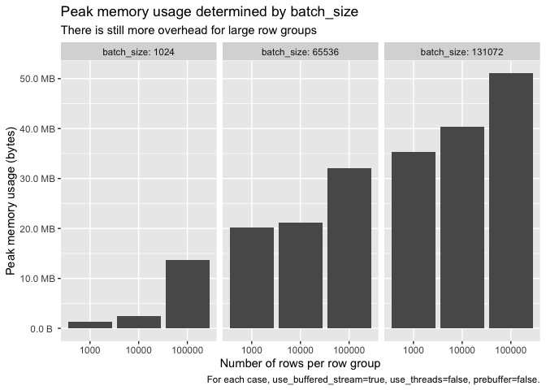
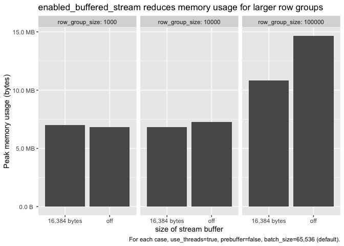
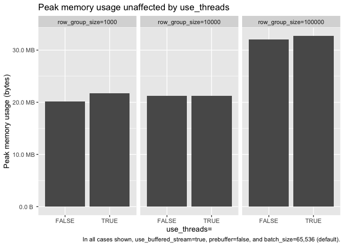

Parquet Read Memory Usage
================

The benchmarks in this repo are designed to determine to what degree we
currently can tune the Arrow C++ Parquet reader to use less memory. The
Parquet reader is by default tuned to be fast, even if at the cost of
using more memory. Tuning to use less memory might mean that reading
Parquet is slower.

To minimize memory use:

1.  Turn prebuffering off
2.  Set a smaller batch size
3.  Turn on `use_buffered_stream` (use default buffer size)

## Analysis

